# Nimons360

Aplikasi mobile Android untuk membantu pengguna mengelola dan memantau family. Fitur utama meliputi autentikasi, manajemen family, dan pemantauan anggota family.

Spesifikasi aplikasi mengacu pada dokumen tugas besar.

---

## Deskripsi

Nimons360 adalah aplikasi berbasis Android yang memungkinkan pengguna untuk:

- Login dan mengakses sistem dengan token
- Melihat daftar family yang diikuti (My Families)
- Menemukan family baru (Discover Families)
- Melihat detail family dan anggota
- Bergabung atau keluar dari family

---

## Library yang Digunakan

- Retrofit (API communication)
- Glide (image loading)
- Hilt (dependency injection)
- RecyclerView (list rendering)
- ViewBinding
- MapLibre

---

## Screenshot

1. Home

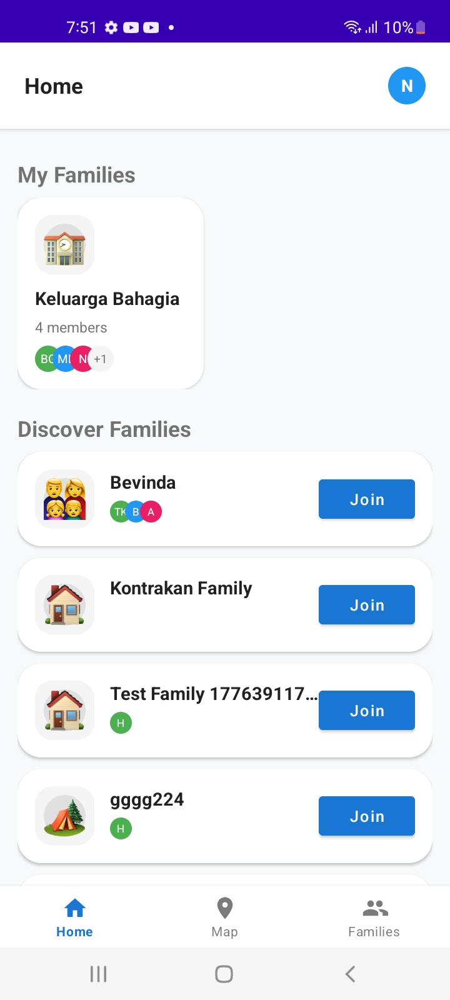

2. Family Detail

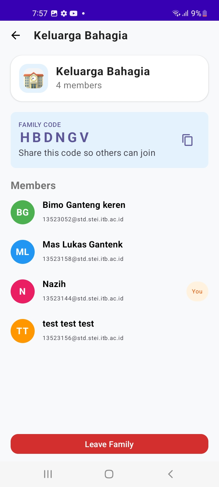

3. Profile

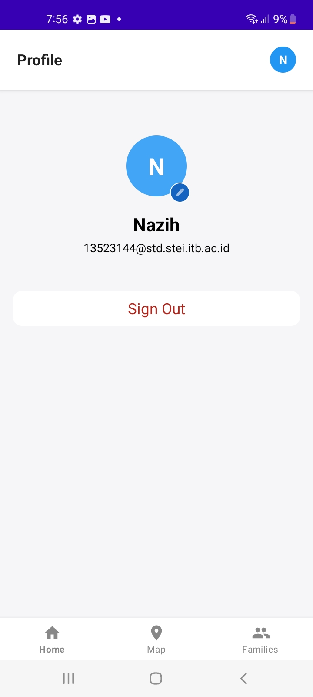

4. Map

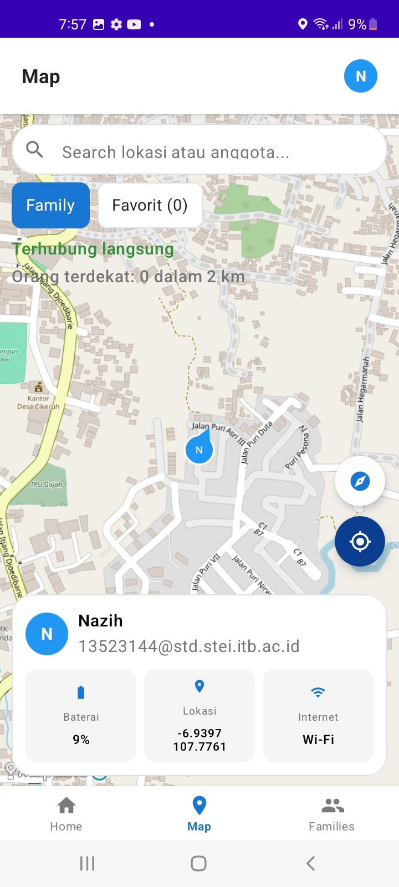

5. Detail User (Map Bottom Sheet)

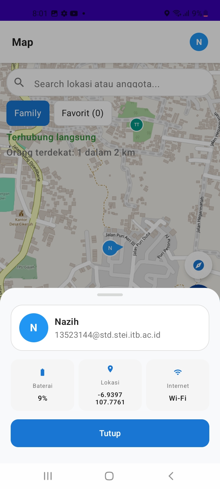

6. Families List

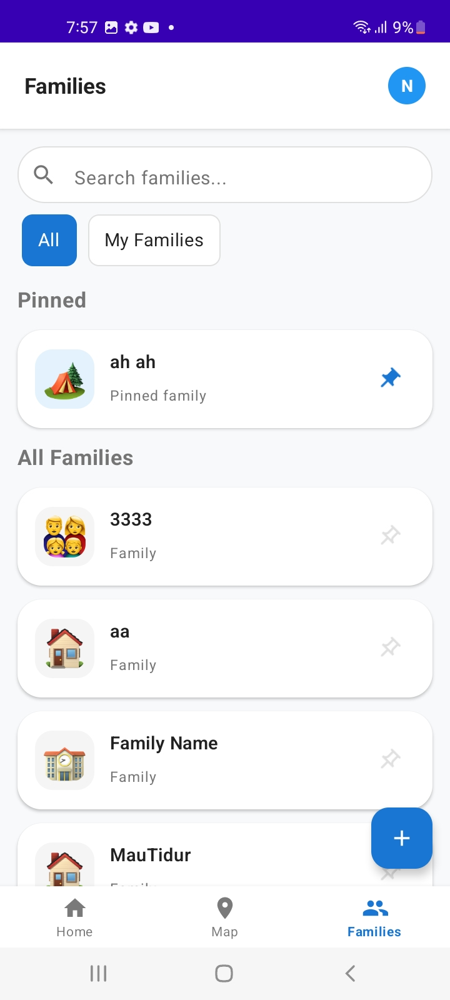

7. Join Family

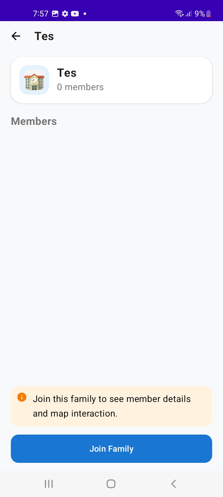

8. Create Family

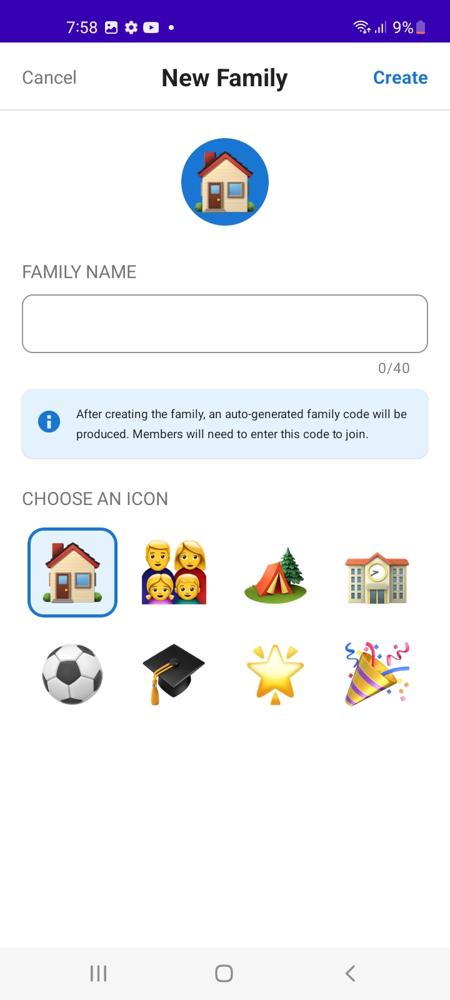

9. My Families

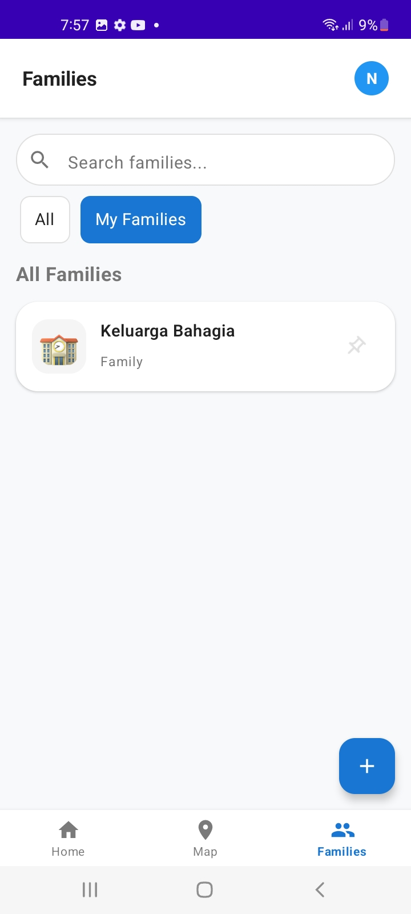

10. Network Sensing

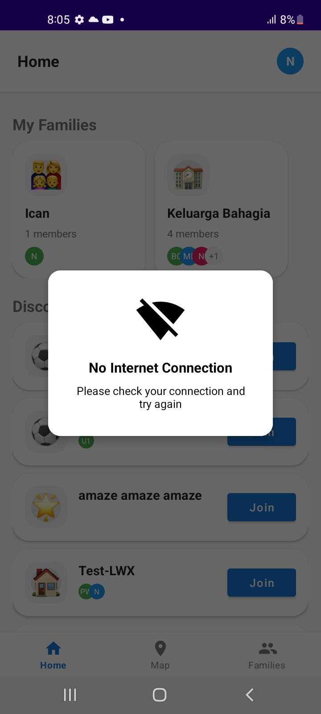

11. Sign Out Dialog

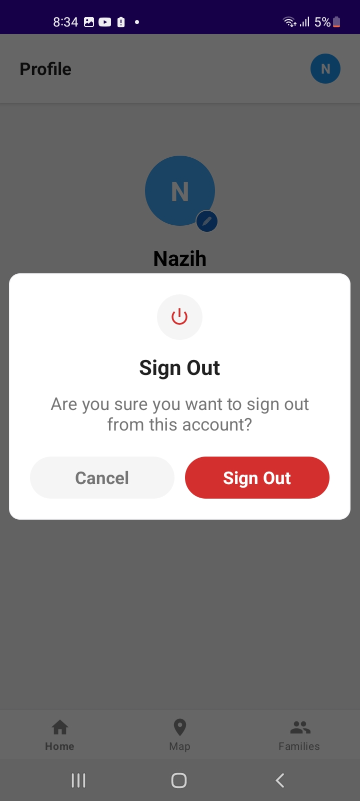

12. Leave Family Dialog
    
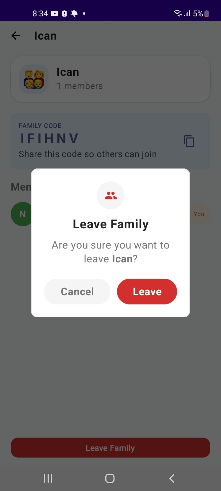

13. Join Family Dialog
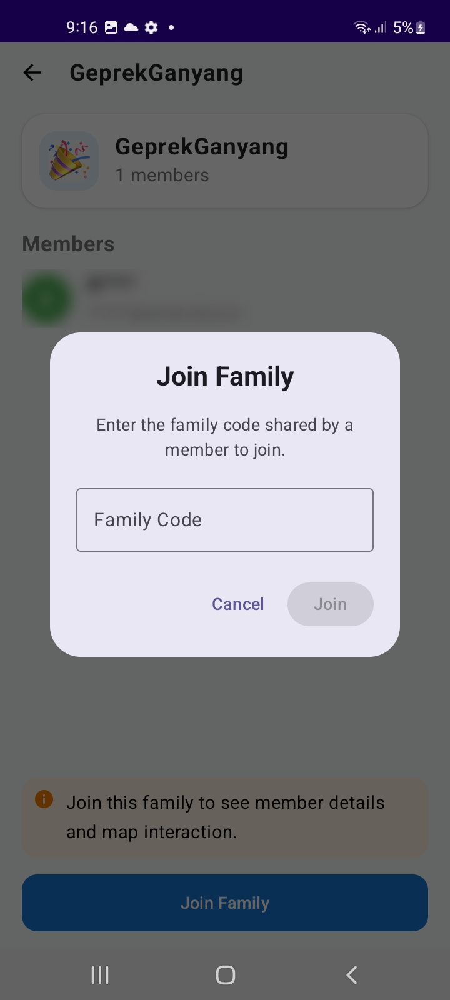

---

## Cara Menjalankan

1. Install Android Studio
2. Pastikan SDK:
  - Minimum SDK: Android 11 (API 30)
  - Compile SDK: Android 15
3. Pastikan Kotlin sudah terpasang
4. Clone repository
5. Buka project di Android Studio
6. Sync Gradle
7. Jalankan emulator atau hubungkan device
8. Klik Run

---

## Kontribusi


| NIM      | Nama                    | Tugas                                                                                                          |
| -------- | ----------------------- | -------------------------------------------------------------------------------------------------------------- |
| 13523144 | Muhammad Nazih Najmudin | Login, Families (Create, Leave & Join, Landing & Pinned & Filter & Search)                                              |
| 13523158 | Lukas Raja Agripa       | OpenAPI (.yaml, runner), Map (Internet Status & Mark Location)                                                 |
| 13523164 | Muhammad Rizain Firdaus | Profile & Edit, Logout, Network Sensing, Header & Bottom Bar (Navigation), Home (MyFamily & Discover Families) |


---

## Catatan

- Aplikasi menggunakan backend yang telah disediakan
- Token digunakan untuk autentikasi setiap request

---

## Bonus
- Search Family
- Internet Status
- Mark Favorite Location

---

# OWASP Mobile Security Analysis

## Praktik Keamanan yang Diterapkan

### 1. Input Validation pada Form
Aplikasi secara aktif mencegah pengiriman data (*request*) yang cacat atau berbahaya ke server dengan melakukan pengecekan di sisi UI:
* **Validasi Kredensial Login:** Pada `LoginActivity`, sistem memvalidasi eksistensi input dan memastikan format email sesuai standar menggunakan `Patterns.EMAIL_ADDRESS`.
* **Validasi Batasan Karakter (Boundary Check):** Pada `JoinFamilyDialog`, panjang *Family Code* dibatasi ketat maksimal 6 karakter. Tombol *Join* otomatis dinonaktifkan jika input kurang atau lebih dari 6 karakter.
* **Validasi Null/Blank:** Pada proses pembuatan keluarga dan pembaruan nama profil, aplikasi memastikan input nama tidak hanya berisi spasi kosong (`isBlank()`).

### 2. Secure Storage (Penyimpanan Data Sensitif)
* **Enkripsi Kredensial Sesi:** Aplikasi menggunakan `EncryptedSharedPreferences` dari Jetpack Security pada komponen `TokenPreference.kt` untuk menyimpan berkas kunci akses JWT. Seluruh data disandikan langsung menggunakan *hardware-backed cryptographic keys* dari *Android Keystore System* untuk mencegah kebocoran *token* (Encryption At-Rest).

### 3. Penggunaan Koneksi Aman & Safe Error Handling
* **HTTPS Enforcement:** Seluruh interaksi API diatur terpusat melalui `NetworkModule.kt` menggunakan protokol enkripsi SSL/TLS `https://mad.labpro.hmif.dev/` (In-Transit Encryption).
* **Information Hiding:** Logika pemrosesan data menggunakan *Wrapper Class* `Result<T>` untuk mengabstraksi pesan *error* mentah (*stack trace* jaringan/database) menjadi pesan generik yang aman sebelum ditampilkan ke pengguna.

---

## Analisis OWASP

### M4: Insufficient Input/Output Validation

| No | Analisis | Perbaikan |
|----|----------|-----------|
| 1 | **Potensi Malformed URL Akibat Index Out of Bounds (CreateFamilyViewModel.kt)**<br><br>Penentuan `iconNumber` menggunakan `availableIcons.indexOf(currentIcon) + 1`. Jika karena suatu kondisi state nilai `currentIcon` tidak ditemukan di dalam `availableIcons`, fungsi `indexOf()` akan mengembalikan nilai `-1`. Hal ini menyebabkan `iconNumber` bernilai `0` (`-1 + 1`) dan menghasilkan URL aset yang tidak valid, seperti `family_icon_0.png`. | **Menambahkan validasi dan nilai fallback** ketika indeks tidak ditemukan sebelum membentuk URL aset.<br><br>```kotlin\nval iconIndex = availableIcons.indexOf(currentIcon)\nval iconNumber = if (iconIndex != -1) iconIndex + 1 else 1\n``` |
| 2 | **Ketiadaan Validasi Batas Panjang Karakter Maksimum (Max Length)**<br><br>Pada validasi nama di `EditNameBottomSheet.kt` dan nama keluarga di `CreateFamilyViewModel.kt`, pengecekan hanya dilakukan untuk memastikan input tidak kosong (`isEmpty()` / `isBlank()`). Input yang terlalu panjang tanpa batas berpotensi menyebabkan kegagalan validasi pada sisi server, error database, atau respons API yang tidak diharapkan. | **Menambahkan validasi panjang karakter maksimum** sebelum mengirim data ke API untuk memastikan input berada dalam batas yang diperbolehkan.<br><br>```kotlin\nif (familyName.length > 50) {\n    _createState.value = Result.Error(\"Nama keluarga maksimal 50 karakter\")\n    return\n}\n``` |

### M8: Security Misconfiguration

| No | Analisis | Perbaikan |
|----|----------|-----------|
| 1 | **Kebijakan Ekstraksi Data & Backup yang Terlalu Longgar (AndroidManifest.xml & backup_rules.xml)**<br><br>Di dalam `AndroidManifest.xml`, atribut `android:allowBackup="true"` diaktifkan bersamaan dengan konfigurasi aturan kosong pada `backup_rules.xml` dan `data_extraction_rules.xml`. Konfigurasi ini mengizinkan sistem mencadangkan data aplikasi, termasuk berkas SharedPreferences dan database Room. Jika penyerang memperoleh akses fisik ke perangkat yang tidak terkunci, data sensitif seperti token autentikasi dapat diekstraksi melalui mekanisme backup aplikasi. | **Menonaktifkan fitur backup** dengan mengubah atribut `android:allowBackup` menjadi `false` apabila fitur backup tidak diperlukan. Jika backup tetap diperlukan, **mengonfigurasi aturan backup secara ketat** dengan mengecualikan direktori database dan penyimpanan kredensial/token pada `backup_rules.xml` dan `data_extraction_rules.xml`. |
| 2 | **Paparan Informasi Sensitif Melalui Logging HTTP di Lingkungan Produksi (NetworkModule.kt)**<br><br>Konfigurasi `HttpLoggingInterceptor` menggunakan tingkat log `Level.BODY`, yang dapat mencetak seluruh isi request dan response HTTP. Konfigurasi ini berisiko mengekspos token JWT, kredensial login, maupun data sensitif lainnya ke Logcat apabila logging aktif pada lingkungan produksi atau terjadi kesalahan konfigurasi build. | **Mengurangi tingkat logging** menjadi `Level.BASIC` atau `Level.HEADERS` pada lingkungan produksi. Selain itu, **melakukan redaksi header sensitif** seperti `Authorization` dan `Cookie` menggunakan fitur `redactHeader()` serta **memastikan mekanisme pengecekan mode debug diterapkan secara aman dan konsisten**. <br><br>```kotlin\nlogging.redactHeader(\"Authorization\")\nlogging.redactHeader(\"Cookie\")\n``` |
| 3 | **Strategi Migrasi Room Database yang Terlalu Destruktif (DatabaseModule.kt)**<br><br>Konfigurasi Room Database menggunakan `fallbackToDestructiveMigration()`, yang akan menghapus seluruh data lokal ketika terjadi perubahan versi skema database tanpa migrasi yang sesuai. Pada lingkungan produksi, konfigurasi ini dapat menyebabkan hilangnya data pengguna secara permanen. | **Membuat skema migrasi database yang eksplisit** untuk setiap perubahan versi database dan **menghapus penggunaan `fallbackToDestructiveMigration()` pada rilis produksi** agar proses migrasi data berjalan secara aman tanpa menghapus data pengguna. |

### M9: Insecure Data Storage

| No | Analisis | Perbaikan |
|----|----------|-----------|
| 1 | **Penyimpanan Token Akses Sensitif Tanpa Enkripsi (TokenPreference.kt)**<br><br>Pada `TokenPreference.kt`, token autentikasi JWT (`auth_token`), nama pengguna (`user_name`), dan ID pengguna (`user_id`) disimpan menggunakan `SharedPreferences` standar dengan mode `Context.MODE_PRIVATE`. Meskipun bersifat private, data tetap tersimpan dalam bentuk teks biasa (plain text) pada direktori aplikasi. Pada perangkat yang di-root atau ketika mekanisme backup dieksploitasi, data tersebut dapat diakses dan digunakan untuk mengambil alih akun pengguna. | **Menggunakan `EncryptedSharedPreferences`** untuk menyimpan token, kredensial, dan data identitas pengguna. Selain itu, **memanfaatkan Android Keystore System** untuk mengelola kunci enkripsi sehingga data sensitif tetap terlindungi saat tersimpan di perangkat. <br><br>```kotlin\nval masterKeyAlias = MasterKeys.getOrCreate(MasterKeys.AES256_GCM_SPEC)\nval sharedPreferences = EncryptedSharedPreferences.create(\n    \"nimons360_secure_prefs\",\n    masterKeyAlias,\n    context,\n    EncryptedSharedPreferences.PrefKeyEncryptionScheme.AES256_SIV,\n    EncryptedSharedPreferences.PrefValueEncryptionScheme.AES256_GCM\n)\n``` |
| 2 | **Ketiadaan Enkripsi SQL pada Database Room Lokal (AppDatabase.kt)**<br><br>Aplikasi menggunakan Room Database untuk menyimpan data lokasi, foto lokasi, dan data keluarga. Secara bawaan, SQLite menyimpan data dalam bentuk yang tidak terenkripsi pada penyimpanan perangkat. Jika perangkat hilang, dicuri, atau dikompromikan, data sensitif seperti koordinat lokasi dan riwayat perjalanan dapat diakses menggunakan alat pembaca SQLite. | **Mengintegrasikan SQLCipher** atau solusi enkripsi database yang kompatibel dengan Room untuk mengenkripsi seluruh berkas database. Selain itu, **mengelola kunci enkripsi secara aman** menggunakan Android Keystore atau mekanisme derivasi kunci yang aman. |
| 3 | **Pencampuran Ruang Penyimpanan Data Sensitif dan Non-Sensitif (TokenPreference.kt & NotificationPreference.kt)**<br><br>`TokenPreference.kt` dan `NotificationPreference.kt` menggunakan berkas preferensi yang sama (`nimons360_prefs`). Penyimpanan data sensitif seperti token JWT bersama data non-sensitif seperti pengaturan notifikasi meningkatkan risiko paparan data apabila berkas preferensi tersebut diakses atau diekspos oleh komponen lain. | **Memisahkan penyimpanan berdasarkan tingkat sensitivitas data**. Menyimpan konfigurasi umum pada berkas preferensi standar, serta **menyimpan token, kredensial, dan data sensitif lainnya pada berkas preferensi terenkripsi yang terpisah**. |
| 4 | **Penyimpanan Path Berkas Unduhan Pin Tanpa Validasi Integritas Jalur (PinPreference.kt)**<br><br>`PinPreference.kt` menyimpan path absolut berkas pin kustom dalam bentuk string. Jika nilai tersebut dimanipulasi melalui perubahan pada SharedPreferences, aplikasi dapat diarahkan untuk mengakses berkas di luar direktori yang seharusnya, sehingga meningkatkan risiko akses berkas yang tidak sah atau eksploitasi path traversal. | **Menyimpan identifier atau nama berkas relatif** daripada path absolut. Selain itu, **membangun objek `File` secara dinamis** menggunakan direktori internal aplikasi yang terpercaya serta **memvalidasi lokasi berkas sebelum digunakan**. <br><br>```kotlin\nval safeFile = File(context.filesDir, \"pins/$fileName\")\n``` |

## Daftar Berkas Temuan dan Perubahan
| Berkas                                                                                 | Kategori Temuan | Deskripsi Perubahan                                                                                                                                                      |
| -------------------------------------------------------------------------------------- | --------------- | ------------------------------------------------------------------------------------------------------------------------------------------------------------------------ |
| `app/src/main/res/xml/backup_rules.xml`                                                | M8 #1           | Mengonfigurasi aturan backup aplikasi secara aman dengan mengecualikan data sensitif dari proses backup sistem Android.                                                  |
| `app/src/main/res/xml/data_extraction_rules.xml`                                       | M8 #1           | Mengonfigurasi aturan ekstraksi data aplikasi pada Android 12+ untuk mencegah data sensitif ikut diekstraksi oleh sistem.                                                |
| `app/src/main/AndroidManifest.xml`                                                     | M8 #1           | Menonaktifkan fitur backup global aplikasi.                                                                                                                              |
| `app/src/main/java/com/example/nimons360/ui/family/create/CreateFamilyViewModel.kt`    | M4 #1, M4 #2    | Memvalidasi indeks ikon keluarga agar tidak menghasilkan nilai di luar batas serta membatasi panjang nama keluarga maksimal 50 karakter.                                 |
| `app/src/main/java/com/example/nimons360/ui/profile/components/EditNameBottomSheet.kt` | M4 #2           | Menambahkan validasi panjang maksimum pada nama profil pengguna.                                                                                                         |
| `app/src/main/java/com/example/nimons360/data/local/preference/PinPreference.kt`       | M9 #4           | Mengubah mekanisme penyimpanan lokasi berkas pin menjadi berbasis nama berkas relatif dan membangun objek `File` secara dinamis menggunakan direktori internal aplikasi. |
| `app/src/main/java/com/example/nimons360/data/local/preference/TokenPreference.kt`     | M9 #1, M9 #3    | Memisahkan penyimpanan data sensitif dan non-sensitif serta mengimplementasikan `EncryptedSharedPreferences`.                                                            |
| `app/src/main/java/com/example/nimons360/di/AppModule.kt`                              | M9 #1, M9 #3    | Menyediakan instance `TokenPreference` melalui dependency injection dan menginisialisasi `EncryptedSharedPreferences`.                                                   |
| `app/src/main/java/com/example/nimons360/di/DatabaseModule.kt`                         | M8 #3, M9 #2    | Mengintegrasikan SQLCipher untuk mengenkripsi database Room dan menghapus penggunaan `fallbackToDestructiveMigration()`.                                                 |
| `app/src/main/java/com/example/nimons360/di/NetworkModule.kt`                          | M8 #2           | Mengamankan konfigurasi `HttpLoggingInterceptor` dan memastikan logging hanya aktif pada mode debug yang valid.                                                          |
